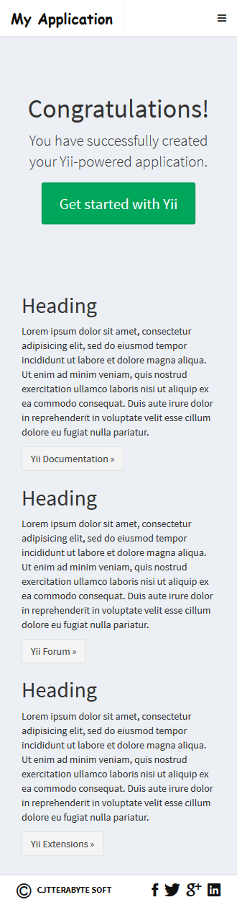
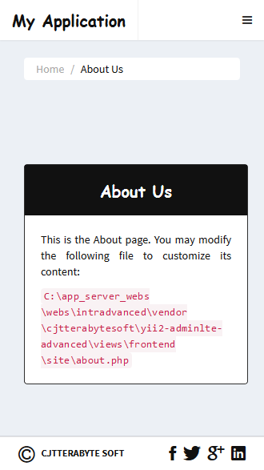
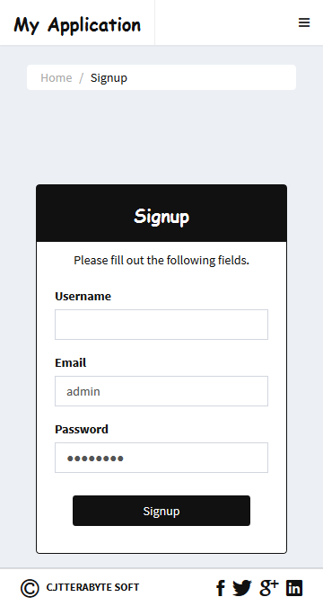
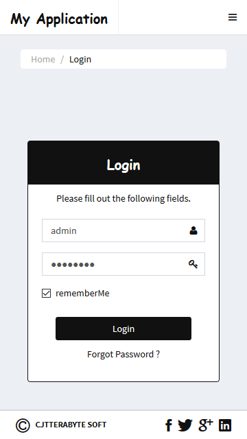
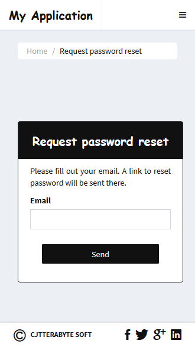
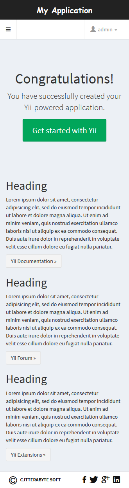
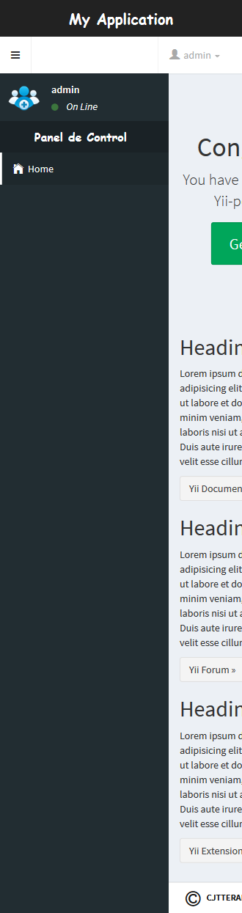

Yii2 AdminLTE - Advanced App Template.
======================================

[Theme - Skin-Black - Mobile]
----------------------------------------------------------------

#### 1.- [Layout - Main]:

#### 2.- [Layout - About Us]:

#### 3.- [Layout - Contact]:

#### 4.- [Layout - Signup]:

#### 5.- [Layout - Login]:

#### 6.- [Layout - Request Password Reset]:

#### 7.- [Layout - Panel Admin Close]:

#### 8.- [Layout - Panel Admin Open]:

