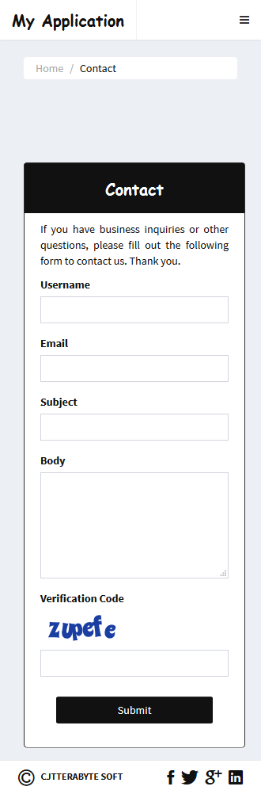

Yii2 AdminLTE - Advanced App Template.
======================================

[Theme - Skin-Black - Mobile].

----------------------------------------------------------------

#### [Layout - Main]:

#### [Layout - About Us]:

#### [Layout - Contact]:

#### [Layout - Signup]:

#### [Layout - Login]:

#### [Layout - Request Password Reset]:

#### [Layout - Request Password Reset]:

#### [Layout - Panel Admin Close]:

#### [Layout - Panel Admin Open]:

