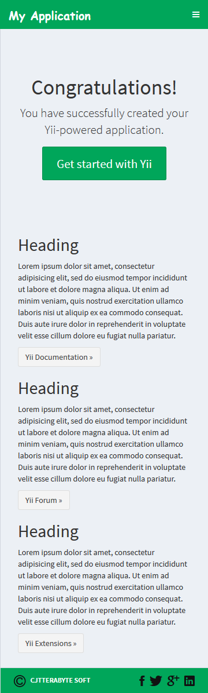
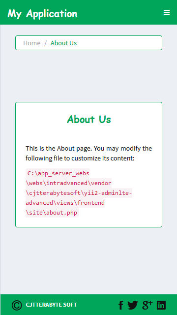
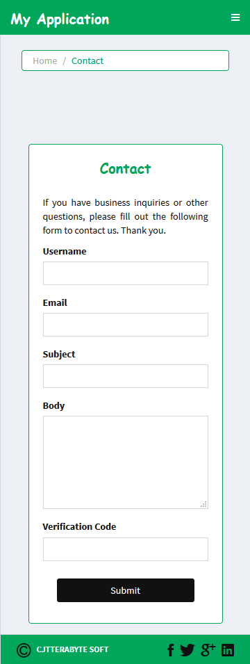
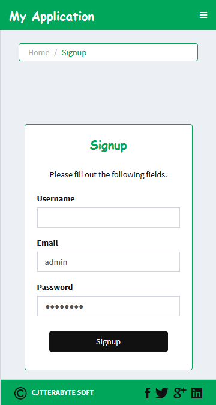
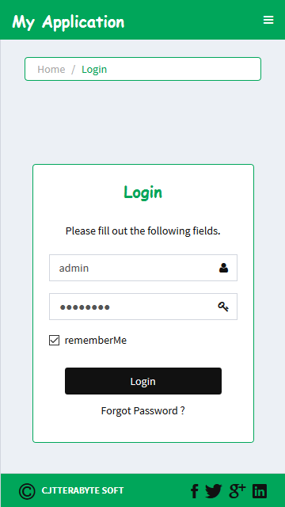
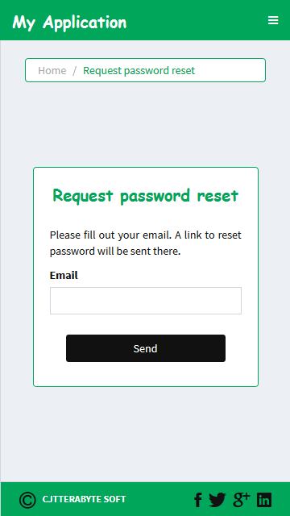
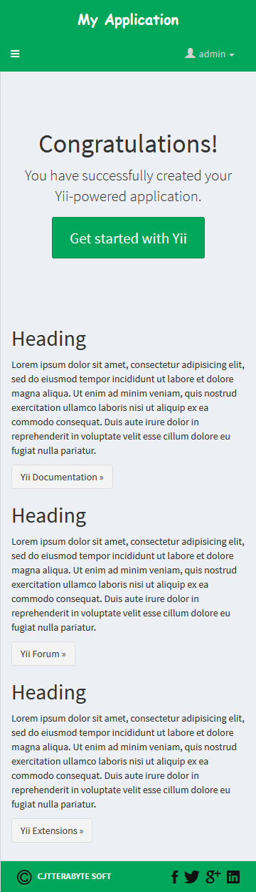
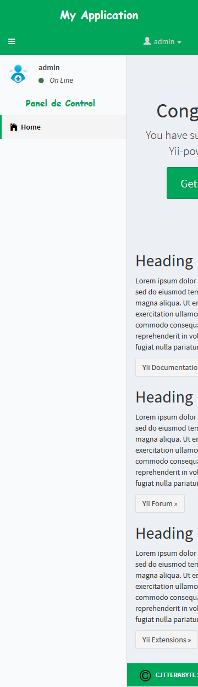

Yii2 AdminLTE - Advanced App Template.
======================================

[Theme - Skin-Green-Light - Mobile]
------------------------------------------------------

#### 01.- [Layout - Main]:

#### 02.- [Layout - About_Us]:

#### 03.- [Layout - Contact]:

#### 04.- [Layout - Signup]:

#### 05.- [Layout - Login]:

#### 06.- [Layout - Request_Password_Reset]:

#### 07.- [Layout - Panel_Admin-Close]:

#### 08.- [Layout - Panel_Admin-Open]:

